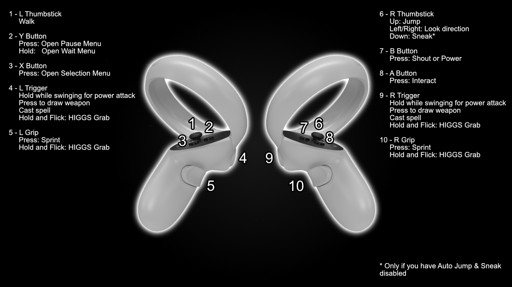

# Controller Bindings

## Oculus Headsets

## Neo's Bindings (must be enabled before creating character)

## Valve Index (with the Alternative VRIK Bindings selected)

**Gameplay Bindings**

| **Binding**      | **What it Does**                              |
|------------------|-----------------------------------------------|
| Left Thumbstick  | Movement                                      |
| Left Trigger     | Cast Spell / Power Attack                     |
| Left A (Press)   | Tween Menu (Inventory / Magic / Map / Skills) |
| Left A (Hold)    | Draw / Sheathe                                |
| Left B (Press)   | Wait Menu                                     |
| Left Grip (Hold) | Sprint                                        |
|                  |                                               |
| Right Thumbstick | Turn (L/R), Jump (Up), Sneak (Down)*          |
| Right Trigger    | Cast Spell / Power Attack                     |
| Right A          | Activate                                      |
| Right B          | Shout                                         |
| Right Grip       | Exit Menu                                     |

**Inventory Bindings**

| **Binding**   | **What it Does**    |
|---------------|---------------------|
| Left Trigger  | Equip to left hand  |
| Left A        | Drop                |
| Left Grip     | Exit Menu           |
|               |                     |
| Right Trigger | Equip to right hand |
| Right A       | Take single item    |
| Right B       | Favourite item      |
| Right Grip    | Item Zoom           |

## WMR Headsets
For WMR headsets, all bindings are default except...

| **Binding**    | **What it Does**    |
|----------------|---------------------|
| Right Touchpad | Shout               |
| Right Grip     | Interact            |

## Other Bindings
There are some other bindings added by mods:

* L or R Thumbstick Click - VRIK Gestures (configurable)
* L or R Grip - VRIK Holsters (configurable)
* L or R Both Grip & Trigger - Spell Wheel
* L or R Trigger, Swing and release trigger - Throw Weapon

## SexLab VR Controls

These controls only apply when in a SL scene. The direction indicator means to move your whole hand, not the thumbstick!
If using Neo's bindings L Thumbstick click = Y

* R Thumbstick Click + Left - Previous Scene Stage
* R Thumbstick Click + Right - Next Scene Stage
* R Thumbstick Click + Up - End Scene
* R Thumbstick Click + Down - Swap Actor Positions
* R Thumbstick Click + Forward - Toggle Scene Auto-Advance
* R Thumbstick Click + Back - Toggle 1st/3rd Person Mode
* R Thumbstick Click + Left then Right - Previous Animation
* R Thumbstick Click + Right then Left - Next Animation
* R Thumbstick Click + Down then Up - Move Scene Location
* R Thumbstick Click + Up then Down - Toggle Free Cam or Fly Cam mode
* R Thumbstick Click + Forward then Back - Disable/Enable Animation
* R Thumbstick Click + Back then Forward - Rotate Scene
* L Thumbstick Click + Up - Adjust Schlong
* L Thumbstick Click + Left - Align Actors for current stage
* L Thumbstick Click + Right - Align Actors for all stages

**While adjusting:**

* L Thumbstick Click - End Adjust Mode
* R Thumbstick Click - Reset Adjustments for current animation
* Left Trigger (Hold) - Grab and Adjust Actor/Schlong by movement of left controller 
* Right Trigger - Select next actor to adjust
