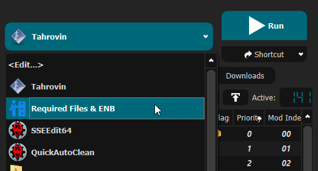
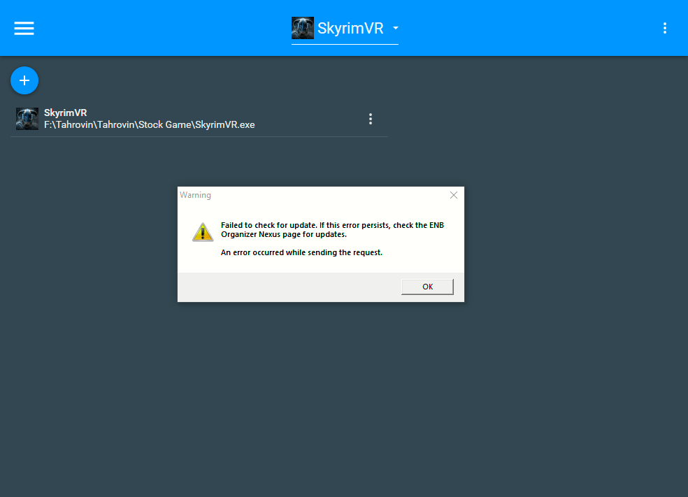
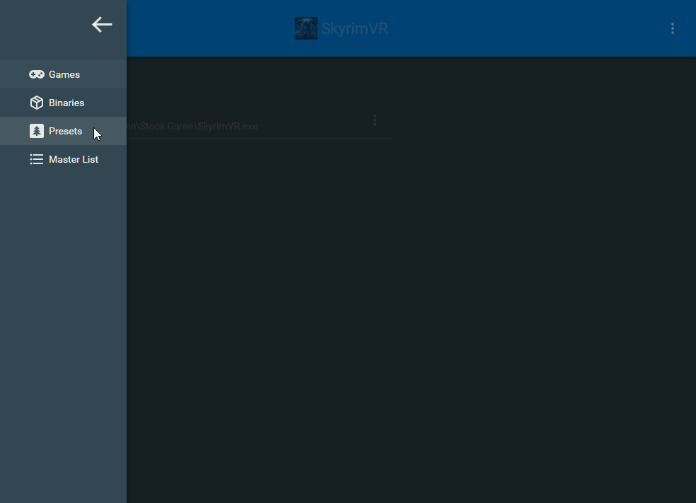
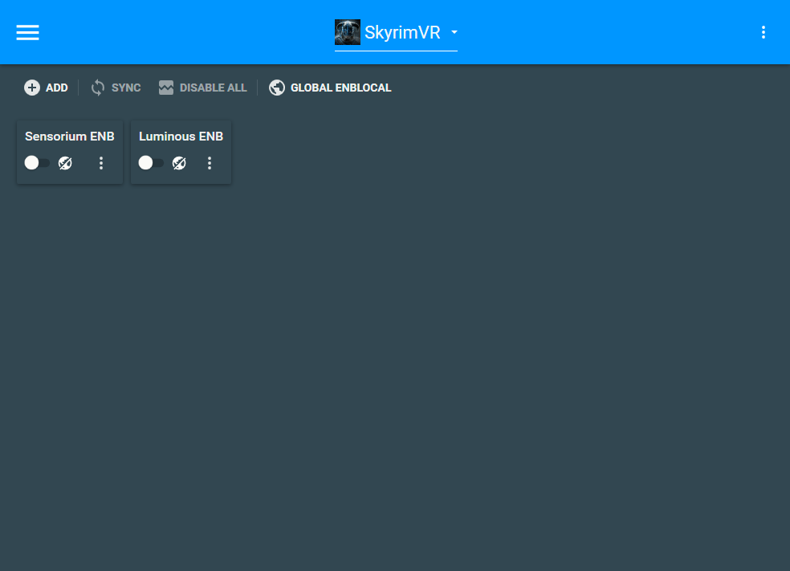
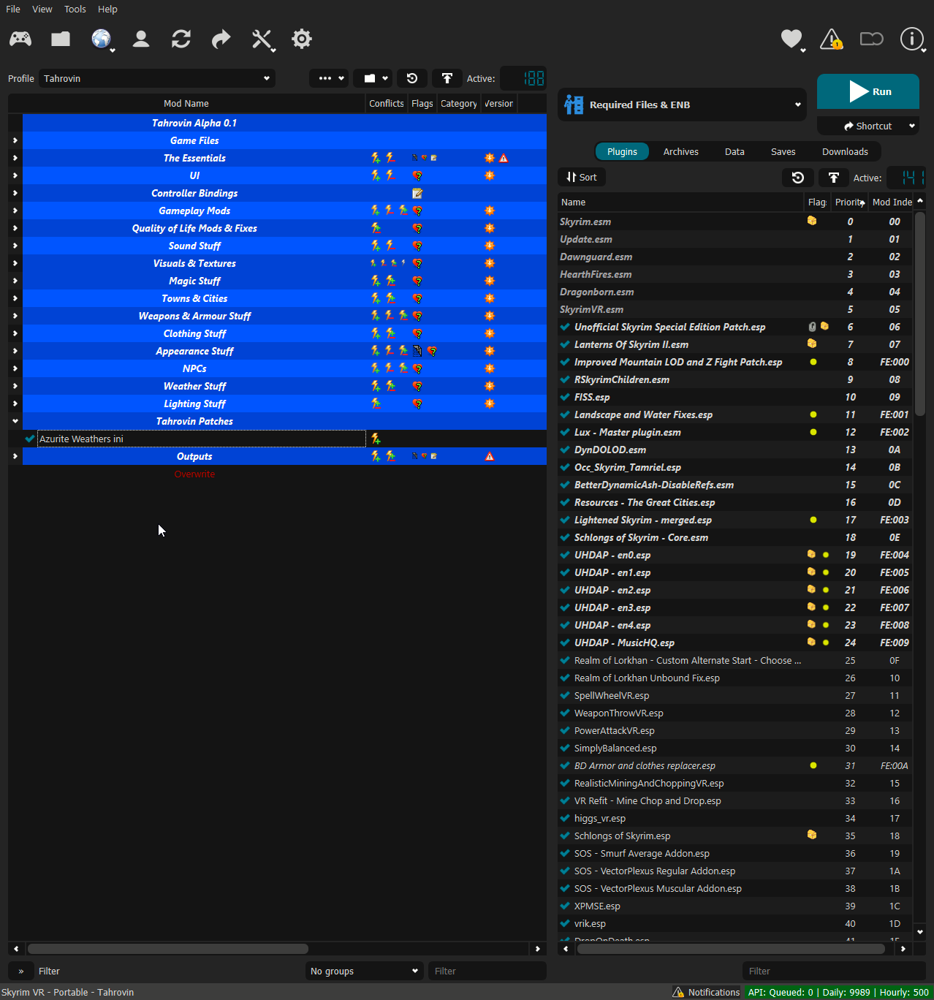
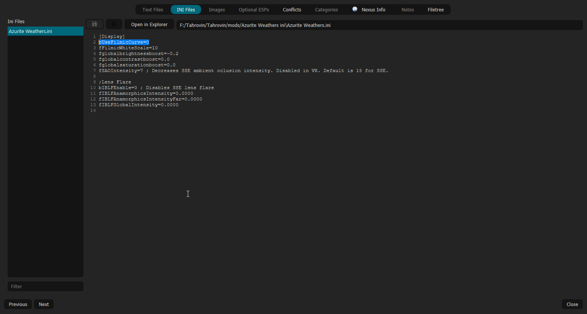

# ENB Selection
As mentioned earlier, in both global and game settings within Steam and Oculus settings you must ensure the following is set:
  * Supersampling is *OFF*
  * Render Resolution to 100% (1.0 if you're looking at Oculus settings)

Choosing your ENB is simple and doesn't involve jumping into the game files to manually move stuff about either. In MO2, from the dropdown, select `Essential Files & ENB` and then the run button.

ENB Organizer will then launch. If you see an error message regarding a failure to connect to Nexus Mods for updates, click the OK button.

Click the hamburger menu at the top left of the program and navigate to the presets window.

From this screen, you can choose the ENB of your choice. I'd recommend that you check out the presets pages on Nexus for previews to see which one takes your interest the most. Only pick 1 ENB and once you've picked whichever ENB you like, click the `SYNC` button.

**IMPORTANT NOTE:** The Sensorium ENB requires you to change the ini file for Azurite Weathers. I have an overwrite setup in the "Tahrovin Patches" category. See [below](#azurite-weathers-ini-change) for details for the changes required and how to perform them.

### Azurite Weathers ini Change
If you're using the Sensorium ENB, you need to change `bUseFilmicCurve` in the Azurite Weathers ini to `0`. In MO2, open the "Tahrovin Patches" category and double-click on the "Azurite Weathers ini" mod.

A new window will pop up. At the top of this new window, select "INI Files", select `Azurite Weathers.ini` from the left hand list. Find `bUseFilmicCurve` in the editing pane and change it to `bUseFilmicCurve=0`. Save the file and close down the window.

If you change to a reshade of any kind, follow these same steps again but set `bUseFilmicCurve` to `1` instead.