# Quest 2 Performance Tips
There are a couple things you can do that can help with performance that I recommend.

## Using OpenComposite
To switch to Open Composite select OC swapper in the dropdown menu in MO2

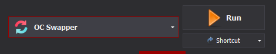

then click the button!

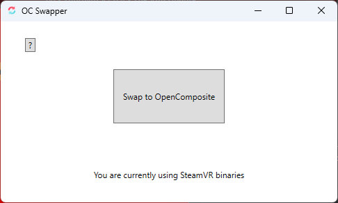

Then you will need to set your prefered platform to handle OpenXR

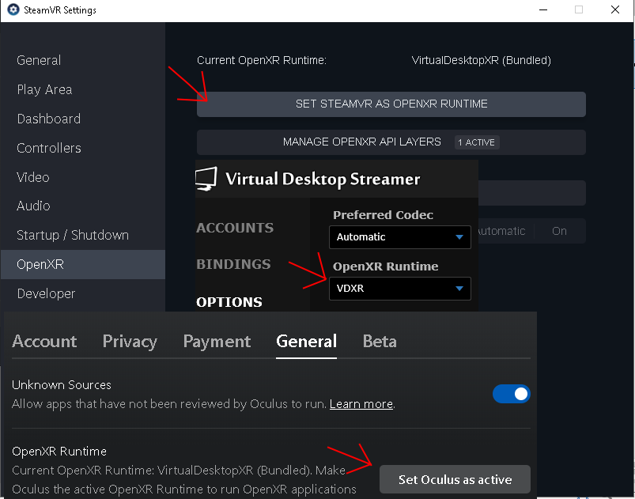

Optionally if you would like to have a name other than Adventurer when using Open Composite you can use the OC Character Renamer in the Your Choices section of MO2. Just right click on the mod, open in explorer, open the root folder and open opencomposite.ini. You can then change Tahrovin to be whatever you want your character to be named when you finish character creation.

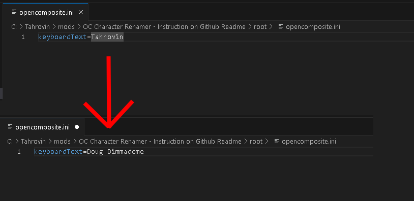

***Note:** OpenComposite does not work for any other headset than Oculus headsets!*

## Change Refresh Rate
Changing the refresh rate to a higher one in the Oculus settings reduces the maximum resolution delivered to your headset as well as offering a smoother feel to the game. The reduced resolution will help the game run at a more stable FPS and likely a higher FPS. Combine the higher FPS with the higher refresh rate of the Quest 2 and you have a much nicer game playing experience. 

So, to do this you need to start by connecting your Quest 2 headset to your PC via USB, power your headset on and then head over to **Devices** in the left-hand menu of the Oculus PC client.

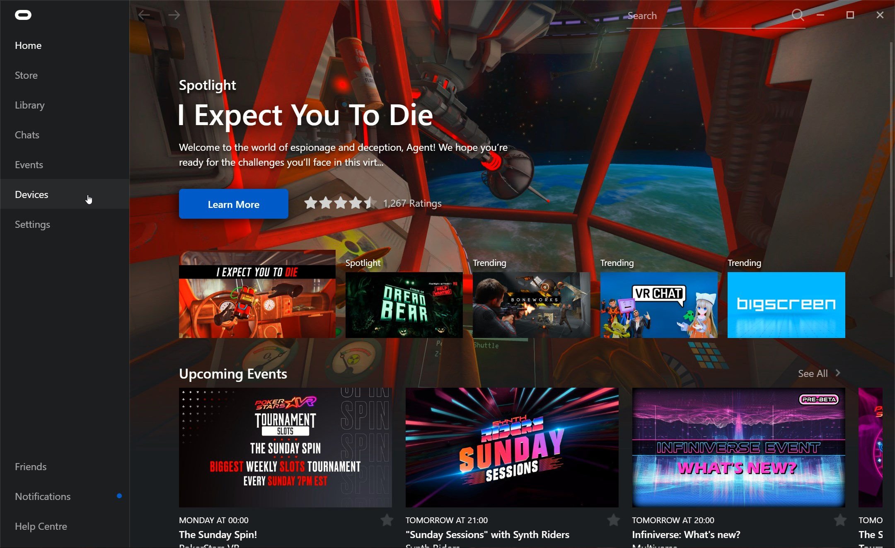

When in there, connect select the top menu option:

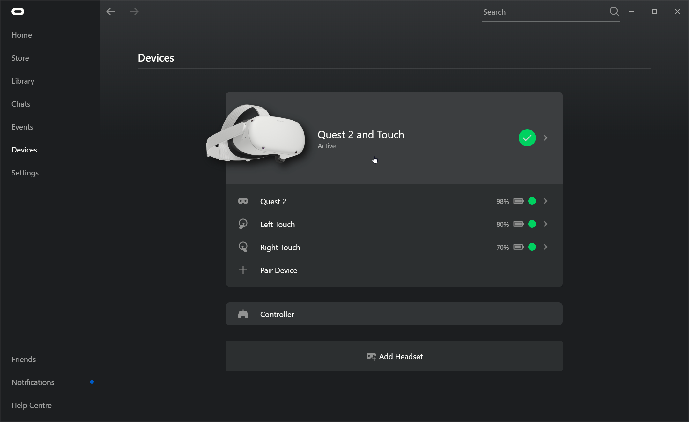

In the right-hand menu that pops-up, scroll down to **Graphics Preferences**:

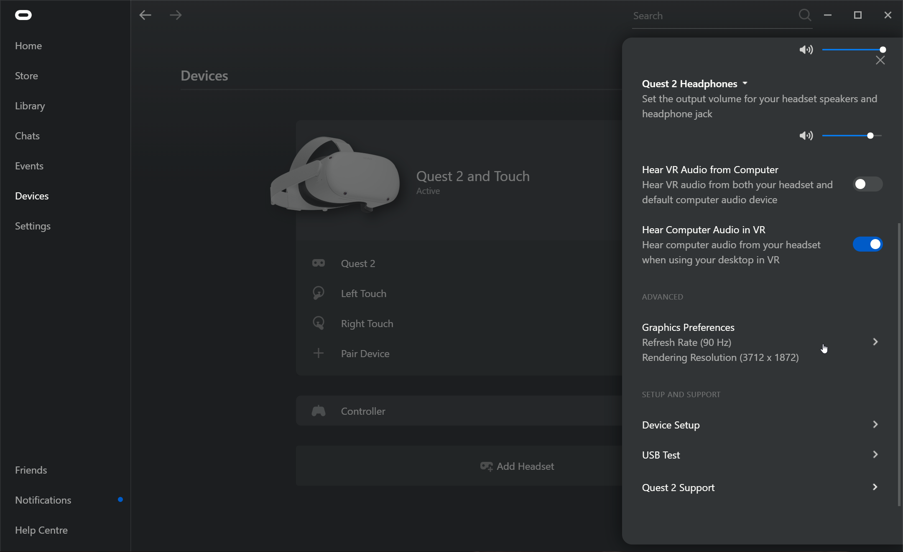

In the pop-up menu, ensure that the **Automatic** resolution scaling is *OFF*. I recommend trying each setting in turn to see at which point you get the best look vs performance. I can't tell you what point that would be because it's a subjective choice. Also ensure that the **Rendering Resolution** is at *1.0x* as stated in the main readme.

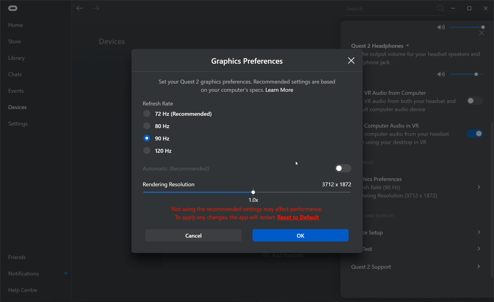

Once you've made your changes, click **OK**.

## Increase the Oculus Link USB Data Rate
For some odd reason, the default Oculus Link settings limit the USB data rate between your PC and the Oculus headset to 100Mbps but the maximum link speed is **500Mbps.** That's *5 times* the data rate over the regular setting.

Increasing the USB data rate means that your PC and your headset can communicate much faster, meaning that VR games will look sharper because there is less compression needed on the data as well as a noticeable reduction in artifacts and flickering in your vision.

To do this, head to the installation folder of the Oculus PC client, usually `C:\Program Files\Oculus`, and head into the **Support** folder:

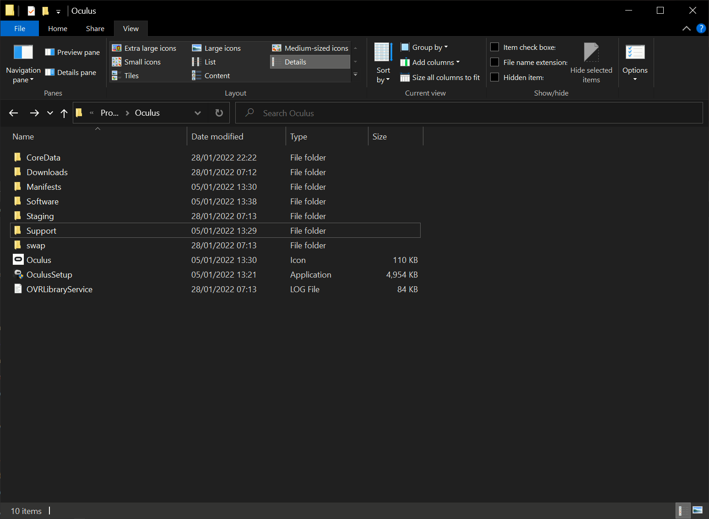

Once there, head into the **oculus-diagnostics** folder:

Once there, run the **OculusDebugTool**:

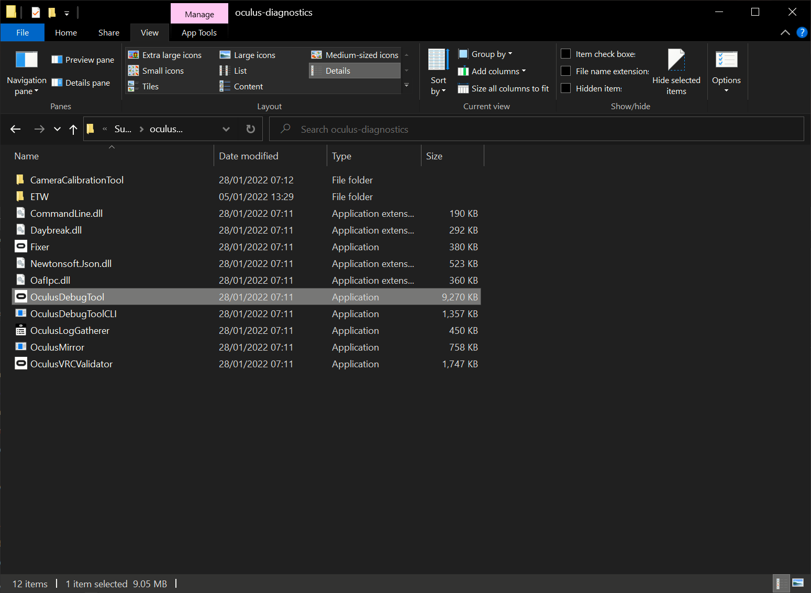

in the Oculus Debug Tool, change **Encode Bitrate (Mbps)** to 350. You can go as high as 500Mbps as mentioned earlier but try somewhere in the middle first before going all in.

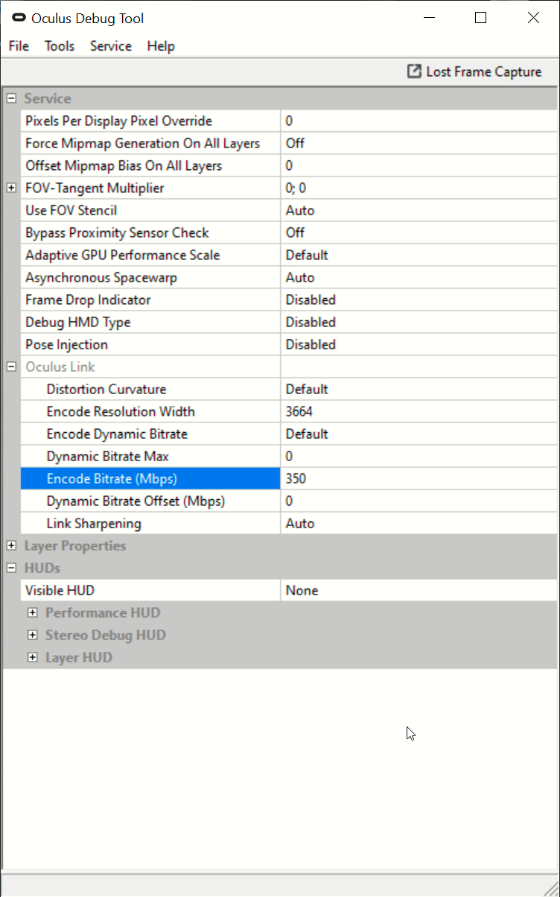

Once changed, close out the tool and done!

## Monitoring Performance with an Oculus Quest 2
The Oculus Debug Tool also comes with a performance overlay. Follow the steps above to open the Oculus Debug Tool and set the **Visible HUB** option to *Performance*.

***DON'T CLOSE THE OCULUS DEBUG TOOL AS THIS WILL ALSO CLOSE THE PERFORMANCE OVERLAY.***

You will know when it is enabled as soon as you put on your headset. You can use the info here to help with monitor the performance you are getting in-game.