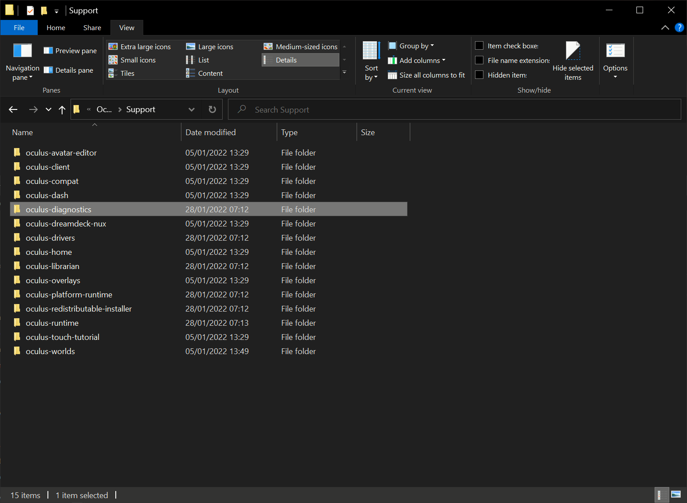

# Quest 2 Performance Tips
There are a couple things you can do that can help with performance that I recommend you to do.

## Change Refresh Rate
Changing the refresh rate to a higher one in the Oculus settings reduces the maximum resolution delivered to your headset as well as offering a smoother feel to the game. The reduced resolution will help the game run at a more stable FPS and likely a higher FPS. Combine the higher FPS with the higher refresh rate of the Quest 2 and you have a much nicer game playing experience. 

So, to do this you need to start by connecting your Quest 2 headset to your PC via USB, power your headset on and then head over to **Devices** in the left-hand menu of the Oculus PC client.

When in there, connect select the top menu option:

In the right-hand menu that pops-up, scroll down to **Graphics Preferences**:

In the pop-up menu, ensure that the **Automatic** resolution scaling is *OFF*. I recommend playing on 90Hz or 120Hz. Also ensure that the **Rendering Resolution** is at *1.0x* as stated in the main readme.

Once you've made your changes, click **OK**.

## Increase the Oculus Link USB Data Rate
For some odd reason, the default Oculus Link settings limit the USB data rate between your PC and the Oculus headset to 100Mbps but the maximum link speed is **500Mbps.** That's *5 times* the data rate over the regular setting.

Increasing the USB data rate means that your PC and your headset can communicate much faster, meaning that VR games will look sharper because there is less compression needed on the data as well as a noticeable reduction in artifacts and flickering in your vision.

To do this, head to the installation folder of the Oculus PC client, usually `C:\Program Files\Oculus`, and head into the **Support** folder:

Once there, head into the **oculus-diagnostics** folder:

Once there, run the **OculusDebugTool**:

in the Oculus Debug Tool, change **Encode Bitrate (Mbps)** to 350. You can go as high as 500Mbps as mentioned earlier but try somewhere in the middle first before going all in.

Once changed, close out the tool and done!