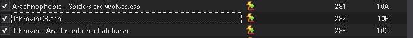
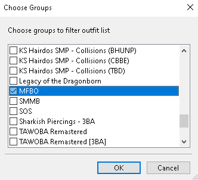
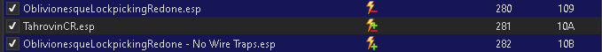

# Optional Mods Instructions

Follow the instructions under each mod if you wish to enable that optional mod.

## Arachnophobia - Spiders are Wolves - Chaurus are Bears - No Cobwebs or Eggs

1. Enable the mod and the Tahrovin - Arachnophobia Patch
2. On the right panel in the plugins tab place Arachnophobia - Spiders are Wolves.esp above TahrovinCR.esp and Tahrovin - Arachnophobia Patch.esp just below TahrovinCR.esp

## Sexlab - Cum Overlays

This one is most likely enabled by default but incase you disabled it and want it back
1. Enable the mod and SCOE Texture Set
2. Place it above TahrovinCR.esp in the right panel in the plugins tab

## Smalls

This one has a dedicated section on the main page

## Daedric Bitchs

1. Enable both Daedric Bitchs SE and 3BA files for Daedric Bitchs 
2. place the ESP for Daedric Bitchs just below the last follower ESP in the list, usually k101daegon.esp.
3. Open Bodyslidex64
4. Click the magnifying glass next to group filter in the top right and select choose groups

5. Select the MFBO group and click okay

6. Make sure the preset is set to - Zeroed Sliders -
7. In the bottom left click Batch Build, then on the following window click okay.
8. Play Tahrovin and enjoy!

## AddItemMenu

1. Enable AddItemMenu - NG and AddItemMenu - NG Patch
2. If using SteamVR you can also enable AddItemMenu search VR keyboard patch to enable searching with the steam vr keyboard.
3. Place AddItemMenuSE.esp just below SOSRaceMenu.esp
4. Play Tahrovin!

## VR FPS Stabilizer - Occlusion FPS boost

This one is simple, it'll bump your frames up a bit in exchance for causing a little bit of texture flickering in a select few areas. Just enable it if you want to use it. Can be enabled or disabled at any time.

## CBBE 3BA Vanilla Outfits Redone (TAWOBA REPLACER)

This one is for people who don't like the skimpy bikini armor of The Amazing World of Bikini Armor and find it unimmersive.

1. Enable CBBE 3BA Vanilla Outfits Redone (TAWOBA REPLACER)
2. Move the ESP above TahrovinCR.esp
3. Open BodySlide x64
4. click the magnifying glass next to group filter in the top right and click choose groups

5. Check all 3 CBBE 3BA Vanilla options

6. Make sure the preset is set to - Zeroed Sliders - and then click batch build in the bottom left and then click build on the next window
7. For each option pick the variant that you want in your game.
Physics = will have physics
NoPhysics = will not have physics
ImPhysics = will have more immersive physics based on the mod authors tastes and edits.
8. Click okay, then let it finish.
9. Close Bodyslide
10. Open Synthesis and wait for all the patches to finish compiling.
11. Click the run arrow at the bottom left and let all of the patches finish.
12. Close Synthesis
13. Run Tahrovin!

## Oblivionesque Lockpicking Redone

Changes the lockpicking minigame to one similar to oblivion's, I personally find it way more fun.

1. Enable Oblivionesque Lockpicking Redone and O.L.R. Retexture - Visually Realistic Lockpicking - Oblivion Lock Mod
2. Place the OblivionesqueLockpickingRedone.esp above TahrovinCR.esp and OblivionesqueLockpickingRedone - No Wire Traps.esp just below TahrovinCR.esp

3. If when playing you get a bug where your lockpick repeatedly shatters after pressing trigger enable Change Lockpicking button to A for Oblinionesque Lockpicking Redone
4. Have fun!

## Lorkhan Music Replacer

1. Enable Lorkham Music Replacer in the left panel of MO2
2. Drag LORKHAN - UI Sound Effects.esp above TahrovinCR.esp in the right panel under plugins and make sure it is enabled

## QuicklootVR ##
1. Enable Quickloot VR in the left panel of MO2
2. Drag QuicklootVR.esp above TahrovinCR.esp in the right panel under the plugins tab