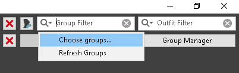

# Optional Mods Instructions

Follow the instructions under each mod if you wish to enable that optional mod.

## Arachnophobia - Spiders are Wolves - Chaurus are Bears - No Cobwebs or Eggs

1. Enable the mod and the Tahrovin - Arachnophobia Patch
2. On the right panel in the plugins tab place Arachnophobia - Spiders are Wolves.esp above TahrovinCR.esp and Tahrovin - Arachnophobia Patch.esp just below TahrovinCR.esp

## Sexlab - Cum Overlays

This one is most likely enabled by default but incase you disabled it and want it back
1. Enable the mod and SCOE Texture Set
2. Place it above TahrovinCR.esp in the right panel in the plugins tab

## Smalls

This one has a dedicated section on the main page

## Daedric Bitchs

1. Enable both Daedric Bitchs SE and 3BA files for Daedric Bitchs 
2. place the ESP for Daedric Bitchs just below the last follower ESP in the list, usually k101daegon.esp.
3. Open Bodyslidex64
4. Click the magnifying glass next to group filter in the top right and select choose groups

5. Select the MFBO group and click okay

6. Make sure the preset is set to - Zeroed Sliders -
7. In the bottom left click Batch Build, then on the following window click okay.
8. Play Tahrovin and enjoy!

## AddItemMenu

1. Enable AddItemMenu - NG and AddItemMenu - NG Patch
2. If using SteamVR you can also enable AddItemMenu search VR keyboard patch to enable searching with the steam vr keyboard.
3. Place AddItemMenuSE.esp just below SOSRaceMenu.esp
4. Play Tahrovin!

## VR FPS Stabilizer - Occlusion FPS boost

This one is simple, it'll bump your frames up a bit in exchance for causing a little bit of texture flickering in a select few areas. Just enable it if you want to use it. Can be enabled or disabled at any time.

## CBBE 3BA Vanilla Outfits Redone (TAWOBA REPLACER)

This one is for people who don't like the skimpy bikini armor of The Amazing World of Bikini Armor and find it unimmersive.

