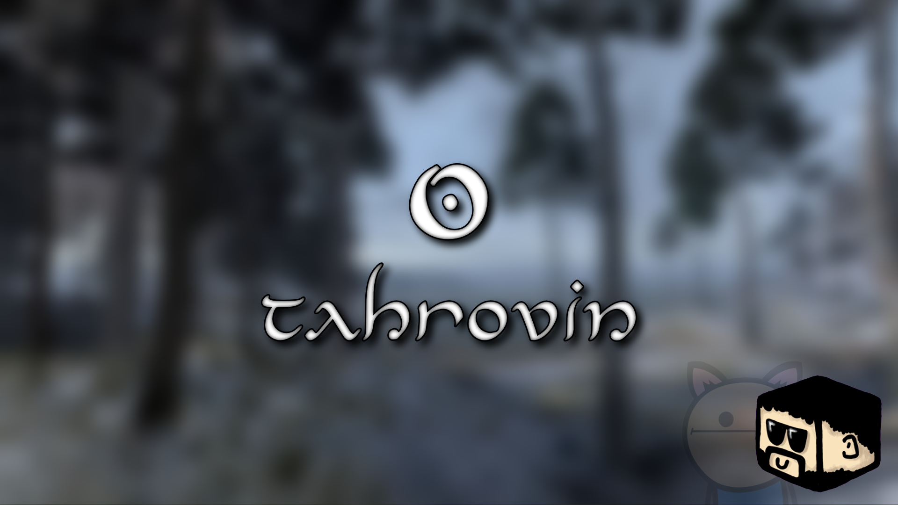
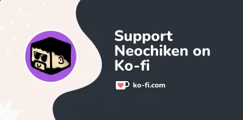
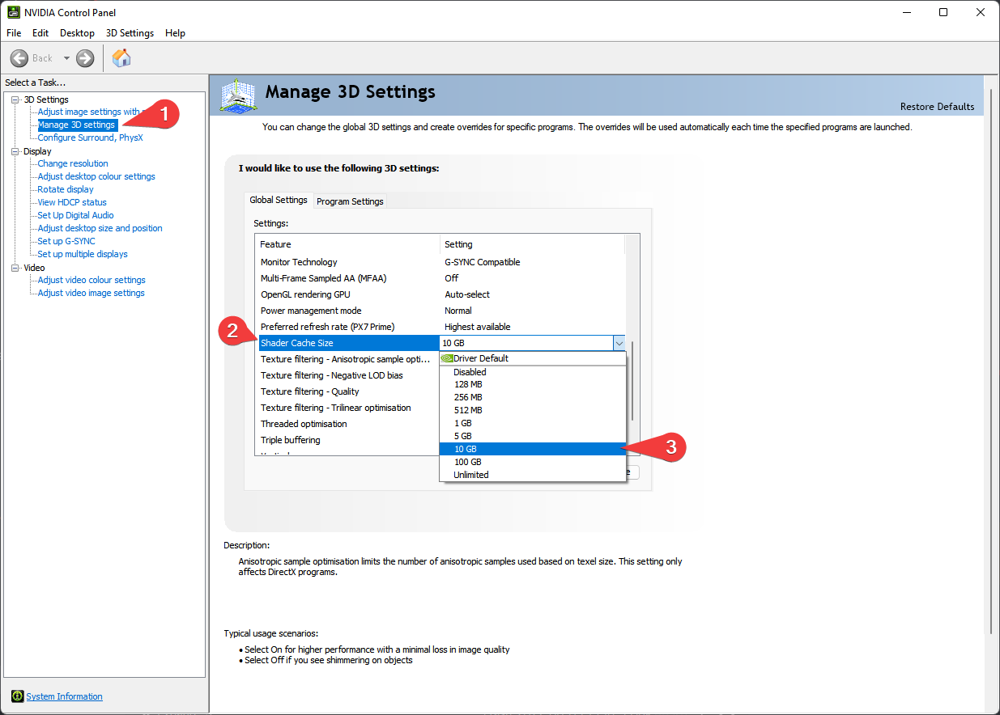
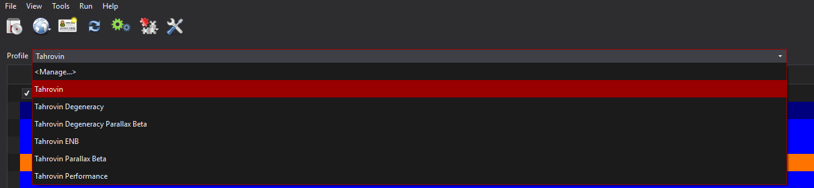
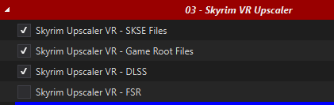
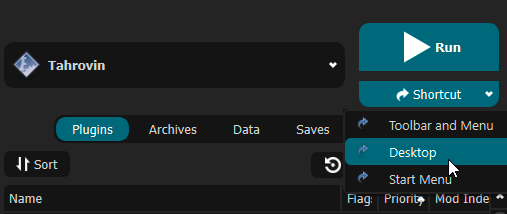
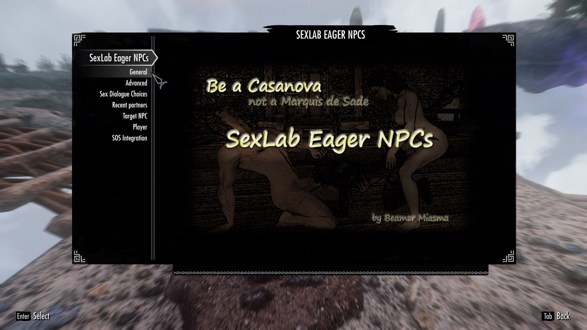
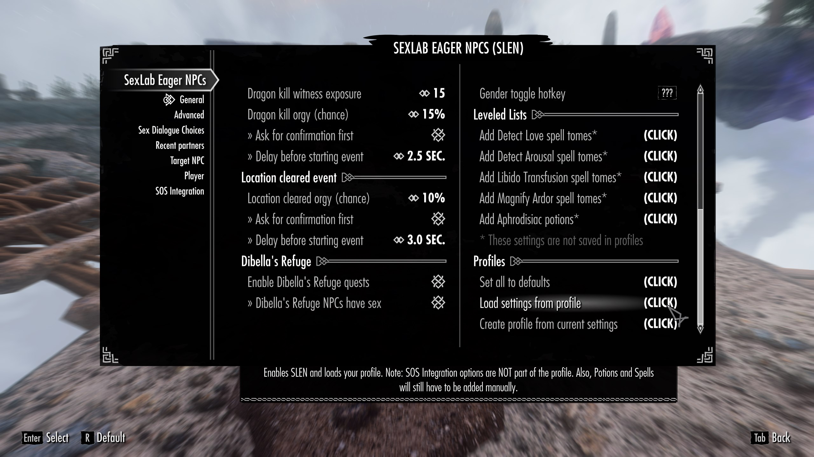

First things first: **this list contains adult content and you must be of legal age in your country. This means 18+ in most countries, 21+ in others. It is up to you to be sure of the age requirement in your country. Tahrovin is a collection of different mods from various sources, it does not reflect the views or opinions of any mod author's featured in the list.**

 

***Having issues with the modlist? [FAQ \& Common Issues](#faq--common-issues)***

 
  
Support and general talk about Tahrovin resides on the iAmMe Modlist Discord:

 

# What is Tahrovin?

Tahrovin is a NSFW Skyrim VR modlist that aims to improve and add upon the Skyrim VR experience. The list features most, if not all, of the fundamental mods needed for any Skyrim VR mod list. The list offers plenty of eye candy paired with everyone's favourite jiggle physics. Yes, this means plenty of skimpy outfits and selectively crafted bodyslides - and no, it's not supposed to be immersive. If you're looking for a more immersive, more difficult, ***grittier*** experience, check out [Tahrovin Grit](https://github.com/AeloveRim/TahrovinGrit).  
And don't worry, for those who prefer to play as a male character, males have also received attention in this list.

 

# Quick Links

- [Changelog](Changelog.md)
- [Controller Bindings](ControllerBindings.md)
- [Gameplay Guide](Gameplay%20Guide.md)
- [Performance Tips](Oculus%20Performance%20Tips.md)
- [Troubleshooting](Troubleshooting.md)
- [Optional Mods](Optional%20Mods.md)
- [Use Reshade 6 with OpenComposite](ReshadeWithOpenComposite.md)

 

# Table Of Contents

- [What is Tahrovin?](#what-is-tahrovin)
- [Quick Links](#quick-links)
- [Before You Start](#before-you-start)
  - [Hardware Requirements](#hardware-requirements)
  - [Accounts](#accounts)
- [Installation](#installation)
  - [Preparation](#preparation)
    - [Install Microsoft Visual C++ Redistributable Packages](#install-microsoft-visual-c-redistributable-packages)
    - [Setup your Page File](#setup-your-page-file)
    - [Setup your Shader Cache](#setup-your-shader-cache)
    - [Configuring Steam](#configuring-steam)
    - [Disable Steam Overlay](#disable-steam-overlay)
    - [Set game language to English](#set-game-language-to-english)
    - [Change Steam's Updating Behavior](#change-steams-updating-behavior)
    - [Clean current Skyrim VR installation](#clean-current-skyrim-vr-installation)
    - [Install Skyrim VR](#install-skyrim-vr)
    - [Start Skyrim VR](#start-skyrim-vr)
  - [Wabbajack](#wabbajack)
  - [Commonly Failing Downloads](#commonly-failing-downloads)
  - [Troubleshooting](#troubleshooting)
- [Post-Installation](#post-installation)
  - [Profiles](#profiles)
  - [Stock Game](#stock-game)
  - [Community Shaders](#community-shaders)
  - [Skyrim VR Upscaler Selection](#skyrim-vr-upscaler-selection)
  - [Creating a desktop shortcut](#creating-a-desktop-shortcut)
  - [Swapping between SteamVR and OpenComposite Binaries](#swapping-between-steamvr-and-opencomposite-binaries)
- [Pre-Game Launch](#pre-game-launch)
  - [DLSS/FSR/XeSS](#dlssfsrxess)
- [Mod Setup](#mod-setup)
    - [*THIS STEP IS IMPORTANT! IF YOU DO NOT DO THIS STEP, YOUR GAME WILL NOT FUNCTION CORRECTLY!*](#this-step-is-important-if-you-do-not-do-this-step-your-game-will-not-function-correctly)
  - [Now go read the Gameplay Guide](#now-go-read-the-gameplay-guide)
  - [Controller Bindings](#controller-bindings)
- [FAQ \& Common Issues](#faq--common-issues) // Update necessary
  - [My game won't start even after a fresh install!](#my-game-wont-start-even-after-a-fresh-install)
  - [I get an OpenComposite error when launching the game?](#i-get-an-opencomposite-error-when-launching-the-game)
  - [I Crashed!](#i-crashed)
  - [Where's my UI?](#wheres-my-ui)
  - [Help I can't see my game!](#help-i-cant-see-my-game)
  - [Is there a way for me to see myself?](#is-there-a-way-for-me-to-see-myself)
  - [How do I change my or an NPC's body?](#how-do-i-change-my-or-an-npcs-body)
  - [Playing in Seated Mode](#playing-in-seated-mode)
  - [IT'S TOO DARK](#its-too-dark)
  - [CAN YOU MAKE IT BRIGHTER/CAN YOU MAKE IT EASIER?](#can-you-make-it-brightercan-you-make-it-easier)
  - [My performance is really bad!](#my-performance-is-really-bad)
  - [Loading takes too long!](#loading-takes-too-long)
  - [I have grey hands/Vive wands in game!](#i-have-grey-handsvive-wands-in-game)
  - [I can't move!](#i-cant-move)
  - [I CTD on launch!](#i-ctd-on-launch)
  - [Can I add XYZ?](#can-i-add-xyz)
  - [Enabling Optional Mods](#enabling-optional-mods)
  - [Giant black square on my screen?](#giant-black-square-on-my-screen)
  - [Can't find your issue here?](#cant-find-your-issue-here)
- [Updating Tahrovin](#updating-tahrovin)
- [Uninstalling Tahrovin](#uninstalling-tahrovin)
- [Thank You's](#thank-yous)

 

---

 

# Before You Start

Before you dive in, there's a couple things you need to be sure of first:

 

## Hardware Requirements // Update Necessary

I run a relatively powerful PC with the following specs:
  * CPU: i7 13700KF
  * RAM: 32GB 
  * GPU: RX 7900 XTX

I use an Oculus Quest 3 headset with wireless Steam Link . **If you are using a Quest 3, I have a couple of performance recommendations that you can [find here](Oculus%20Performance%20Tips.md) if you are struggling to get the game to run well.**  
Now, I have not built this list to be as graphically intensive as possible but I have taken some liberties in installing higher resolution textures as well as offering a couple of the more demanding ENB presets available. With that in mind, I'd recommend at least the following specs for the best experience:
  * CPU: Intel 7th gen *OR* AMD Ryzen 5000 series 
  * RAM: 16GB of DDR4
  * GPU: RTX 3060 *or the AMD equivalent with at least 8GB of VRAM*

You will need at least `162GB` of disk space on an SSD for the installation. For the downloads, you will need an extra `71GB`- ideally you want *at least* `250GB` for temporary Wabbajack work space. It doesn't have to be an NVMe SSD, but a HDD of any kind will make the list painfully unplayable. 

 

## Accounts

In terms of accounts you will need:
  * Nexus Premium Account
  * LoversLab Account

Whilst you don't *need* a Nexus premium account to install the modlist, you'll have a considerably better time of it if you do.

 

---

 

# Installation

Please follow all of steps below if it is your first time installing this modlist, if you're updating you can [jump straight there](#updating-tahrovin).

 

## Preparation

### Install Microsoft Visual C++ Redistributable Packages

This package is a must as it is needed by MO2 - you may already have it if you've used MO2 before. If you do not have it, you want to download the x64 version under "Visual Studio 2015, 2017 and 2019".

[Download Visual C++ Redistributable Package.](https://docs.microsoft.com/en-us/cpp/windows/latest-supported-vc-redist?view=msvc-170)

### Setup your Page File
Skyrim modlists need a large amount of memory purely because of the amount of *stuff* in them - especially modlists on the larger side or with a lot going on, like Tahrovin. For the best experience, you should setup a pagefile of at least **20GB** - yes, even if you have a million GB of RAM. To setup your pagfile;

1. Hold down the *LEFT* Windows key and press **R**
2. Type in `systempropertiesadvanced` in the run box and then press ENTER
3. Under the "Performance" option, click the "Settings..." button
4. Switch to the "Advanced" tab
5. Under "Virtual Memory", click the "Change..." button
6. Uncheck `Automatically manage...` if it's checked
7. Select your *fastest* SSD in the list of drives
8. Check "Custom Size"
9. Set `Initial Size` to 20480
10. Set `Maximum Size` to 20480 also
    1.  *Note: you can set this up to 40000 if you have the space, this will let the pagefile expand to as large as 40GB*
11. Press the "Set" button
12. Press OK
13. Press APPLY and then OK
14. Restart your PC to apply the pagefile setting

### Setup your Shader Cache
Driver defaults from NVidia and AMD for shader cache size is limited to 4GB. Being this small can lead to rare crashes in heavily modified Skyrim installs. Increasing the shader cache size is done via the NVidia Control Panel (I assume the same for AMD users is true also but I don't have AMD hardware to check with). 

*These instructions are NVidia specific as it is the hardware I have.*

1. Open the NVidia Control Panel
2. Head to `Manage 3D Settings`
3. Scroll down in `Global Settings` to find the `Shader Cache Size` option
4. Set the Shader Cache to *at least* 10GB
5. Done

### Configuring Steam
In both global and game settings within Steam and Oculus settings you must ensure the following is set:
  * Supersampling is *OFF*
  * Render Resolution to 100% (1.0 if you're looking at Oculus settings)

### Disable Steam Overlay
The Steam overlay is known to cause issues for both Skyrim VR and regular Skyrim SE/AE, especially when using ENBs. I recommend you turn it off to be sure that it doesn't interfere in any way and you can do so by heading into Steam, right
clicking on Skyrim VR in your game library and clicking **Properties** > **General** > **Deselect "Enable Steam Overlay while in-game"**.

### Set game language to English
Wabbajack and some/most of the modding tools out there only support English language versions of Skyrim. Setting the language to English in Steam will stop issues like Wabbajack file verification failures when installing. As with disabling the overlay, right click on Skyrim VR in your game library and click **Properties** > **Language** > **Select English**.

### Change Steam's Updating Behavior
If for some reason Bethesda decide to release an update for Skyrim VR, everything will probably break. Well, not *everything* but something will definitely break until mods can be updated to suit. To stop this from happening, you need to tell Steam that you only want to update when you tell it to. You can do this by right clicking on Skyrim VR in your game library and clicking **Properties** > **Updates** > **Change Automatic Updates to "Only update this game when I launch it"**. Whilst you're in here, it's also recommended to disable Steam Cloud too.

### Clean current Skyrim VR installation
If you have not yet installed Skyrim VR, you can skip this part.

1. Right click on Skyrim VR in your game library and click **Properties** > **Local Files** > **Browse**. 
2. Uninstall the game via Steam - right click on Skyrim VR in your game library and click **Manage** > **Uninstall**.
3. Check the explorer window for any left over files - if there are any, delete them.
4. Open Windows start menu/search and type in `%LOCALAPPDATA%`.
5. Delete the Skyrim VR folder.
6. Head to `Documents\My Games` and delete the Skyrim VR folder.

### Install Skyrim VR
Once you've done the steps above, you can now set Steam to download Skyrim VR again but ***do not*** install Skyrim VR to a protected folder, such as `Desktop`, `Downloads` or `Program Files` of any kind. It's best to create a new, dedicated folder for it using the Steam Library function somewhere on the root of your drive such as `C:\SteamLibrary`. A lot of people have a dedicated secondary drive for their games, keeping the OS install separate; using this secondary drive will also work.

### Start Skyrim VR
That's right - start the game. You need to let the game do its initial start up jobs such as creating registry entries and generating default config files. Once you've gotten to the main menu you can close the game again.

 

## Wabbajack
Installing the list is straight forward, Wabbajack will do most of the heavy lifting for you - you only have to tell it where to put stuff. Grab the Tahrovin from the Wabbajack UI, once its downloaded the initial stuff it needs, Wabbajack will have 2 things for you to do - fill in the installation location and the download location. 

Set the installation location to a folder on the root of a drive, something like `C:\Tahrovin`. Do not install it to one of the protected folders as mentioned earlier. The download location will have likely been filled in for you too - ensure it matches the directory you set for the installation location, or if you have multiple Skyrim VR modlists installed, use a common download folder - this will stop you from having to redownload common mods across multiple modlists. 

Before you hit **GO**, a quick tip:

*To get the best performance with Wabbajack, it is recommended that you have the install folder for Wabbajack, the modlist folder and the downloads folder on an SSD; ideally the same SSD.* After the installation is complete, you can move the downloads folder to a storage HDD or other storage medium to save space on your game installation drive. It's not recommended to allow your drive to exceed 90% of its storage space used - Windows Explorer will show a red bar under your drive if you do go over 90% so you need to be sure that you have enough space on your installation drive so that you won't exceed this 90% storage level.

Once you have everything set in Wabbajack, hit **GO** and let it do its thing. It might take a while as there is a fair bit to download and the speed of this will depend on your internet performance as well as your CPU in the later stages for hashing and unpacking the downloads.

 

## Commonly Failing Downloads
Downloads from file hosts such as Google Drive and Mega can sometimes be a pain and refuse to download automatically via Wabbajack for reasons unknown. Any files that might give you trouble [can be found here for manual download](https://github.com/iAmMe27/Tahrovin/wiki/Commonly-Failing-Downloads).

Download these files and place them *as they are* into the same folder you told Wabbajack to put your downloads in. Let me reiterate just to be sure - **do not unzip the archives!**

 

## Troubleshooting
If you're having issues with installation, check the [troubleshooting page](Troubleshooting.md). 

 

---

 

# Post-Installation
Almost there but we're not out of the woods yet! After Wabbajack has given you the installation successful screen, you're free to close it. Navigate to the Tahrovin installation folder and run MO2 by double-clicking `ModOrganizer.exe`.

***DO NOT UNDER ANY CIRCUMSTANCES RUN LOOT. The load order is exactly as intended out of the box and you do not need to change it.***

 

## Profiles
Tahrovin comes with a variety of different profiles to match your preferences. You can choose the profile by clicking on the drop down menu in the top center of MO2. 

 - Tahrovin: This is the default profile. It uses Community Shaders (CS for short) and ReShade for visuals and is the core experience all other profiles are built upon
 - Perfomance: This profile sacrifices some of the visual upgrades like CS and ReShade to accomodate lower end systems. It is based on the default profile and makes no sacrifices in gameplay/content mods, so you're only missing out on some visual improvements
 - Degeneracy: This profile adds creature support to the adult frameworks. Be warned, this means there will be bestiality content in your game, hence the name of the profile
 - Tarallax Beta: This profile introduces Parallax, which in combination with CS makes the game even more stunning. Note that this is a Beta profile, meaning there might be places where parallax looks a little off or in rare cases even be obviously broken. If you find such cases, feel free to report them in the discord so I can try to fix them in later updates
 - Degeneracy Parallax Beta: This should be self explanatory, it's the Degeneracy Profile but including parallax
 - ENB: This Profile replaces Community Shaders with ENB, trading off visual improvements in some places for visual improvements in others. Generally speaking ENB looks *prettier*, but Community Shaders look more *consistent*

 

## Stock Game
Tahrovin utilises the stock game feature offered by Wabbajack, meaning that Wabbajack will make a local copy of your Skyrim VR game files during the installation process. This means that your Steam installation of Skyrim VR is completely untouched, even by files that go in the game folder such as ENB files.

 

## Community Shaders
As a note the first time Community Shaders runs it will have to compile shaders, this may take a while and may look like SkyrimVR is frozen, just be patient. This process will also most likely be repeated any time you change mods in the list.
The Community Shaders Menu can be opened with END and from here you can toggle individual shaders on and off.

 

## Skyrim VR Upscaler Selection
Like in the previous section, Skyrim VR Upscaler options are found in MO2 under the `Skyrim VR Upscaler` separator. 

Remember, AMD and non-RTX GPU's must use **FSR** and not DLSS or DLAA.

 

## Creating a desktop shortcut
Nobody wants to be launching their game via multiple clicks, they want to be able to do it from the desktop! This is simple to do - open MO2, ensure **Tahrovin** is selected in the dropdown and click the "Shortcut" button. From the small dropdown menu, click "Desktop". Of course, you can always run from inside of MO2 by clicking the "Run" button instead.

Done! You should now have a shortcut on your desktop which you can now run the modlist from. Don't run Skyrim VR from within Steam as it won't launch MO2's virtual file system to make a modded game instance.

 

## Swapping between SteamVR and OpenComposite Binaries
See Oculus performance tips
[Oculus Performance Tips](Oculus%20Performance%20Tips.md)

 

---

 

# Pre-Game Launch

**Before launching the game, make sure your VR headset is initialised and both controllers are connected. Launching the game, without both of these conditions met will be a bad time.**

 

## DLSS/FSR/XeSS

Refer to the [Skyrim VR Upscaler](#skyrim-vr-upscaler-selection) section.

 

---

 

# Mod Setup

### *THIS STEP IS IMPORTANT! IF YOU DO NOT DO THIS STEP, YOUR GAME WILL NOT FUNCTION CORRECTLY!*

When starting a new game, create your character and once done, *DO NOTHING ELSE* and allow the mods to initialise. Once the notifications stop appearing in the top left of your view, you should calibrate VRIK by using the `VRIK Calibration Power` located in your powers menu. Do this while standing on a flat surface in game. Follow the instructions in the VRIK pop-up dialog to ensure you get this right, otherwise you might find yourself towering over everyone else or way too short. Don't worry about making it absolutely perfect, you can recalibrate at any time. After you've calibrated VRIK, head to the Mod Configuration Menu to start the mod setup.

The MCM setup is *mostly* automated and will run on its own after you've finished character creation. As mentioned, *DO NOTHING* until the window pops-up telling you to save. As one of the MCM menu's doesn't appear to be compatible with MCM Recorder auto-setting, there is a manual part required to configure it - don't worry, it's only 2 steps!

1. Navigate to the Mod Configuration Menu > SexLab Eager NPCs > General

2. Scroll all the way down to the bottom right of the General page and click `Load settings from profile`

Done! Exit the MCM and save.

3. Optionally you can set up Smalls if youd like to have NPCs have underwear when looted. To do this simply take the crystal in the central area by all of the shrines to the smithy, you will find a chest on the wall there labeled "Underwear." Loot everything in that chest and then open the MCM and go to MCM recorder. Find the recording labeled Smalls and play it, close the menu and then select run. After it finishes you are free to put the underwear back in the chest or keep it. You will want to do this first if you want Just In Time underwear as having too many clothing items in your inventory will break the MCM recording.

 

## Now go read the Gameplay Guide
[Right here](Gameplay%20Guide.md)

 

## Controller Bindings
[Controller bindings can be found here](ControllerBindings.md)

 

---

 

# FAQ & Common Issues

 

## My game won't start even after a fresh install!
Check in your `Tahrovin\Stock Game` folder for an `openvr_api.dll` file. If this file is not present, your game cannot start. To solve this, copy the `openvr_api.dll` file from your Skyrim VR Steam installation folder into your `Tahrovin\Stock Game` folder and relaunch.

When using ENB Organizer, **always** disable an option *then* enable another. Not doing this will mess up the files.

 

## I get an OpenComposite error when launching the game?
Like this?

If you are getting an error message like the screenshot when launching the game, you have OpenComposite enabled for a non-Oculus headset or you are using VirtualDesktop. Disable OpenComposite, enable SteamVR.

 

## I Crashed!
Giving me that little info is not helpful. 

Make sure you excluded your Tahrovin folder in your antivirus software. If you use an aggressive antivirus package such as Webroot, Bitdefender, Avast etc etc, I urge you to get rid of it and just use Windows Defender.

Please upload (drag and drop the file into the `#tahrovin-support` Discord channel) the most recent crash log from your `Documents\My Games\Skyrim VR\SKSE` folder.

If you have modified Tahrovin, ignore the previous advice and keep to the `#tahrovin-modifications` Discord channel. I will not help you with modified lists in official support categories - less because I don't want to and more because I cannot.

 

## Where's my UI?
Raise your left hand, palm facing upwards, to activate the compass. Your stat bars are hidden by default, equip the soul gauges in your inventory and assign them as you wish. When it asks for hand offset, I recommend you set the offset to **3**.

 

## Help I can't see my game!
If you have an ENB selected, give it a few seconds as it takes a short period for the game to render as the ENB does its thing.

 

## Is there a way for me to see myself?
Raise your right hand above your head and rotate your wrist to turn your character. If you put your right hand down, your character should stay in selfie mode - re-raise your right hand to disable.

 

## How do I change my or an NPC's body?
Autobody. Default VRIK gesture is Right Thumbstick click + Controller Down. Want to change the Autobody gesture? [Read this.](https://github.com/iAmMe27/Tahrovin/wiki/Changing-Autobody-Hotkey)

 

## Playing in Seated Mode
Tahrovin features the `Auto Sneak and Jump` mod which relies on your movement in real life to jump and crouch, therefore making it not very useful to you if you prefer to play in seated mode. Unless you'd like to try sneaking everywhere you go, you should be fine to disable this mod from the "Gameplay Mods" section in MO2.

 

## IT'S TOO DARK
No it isn't - stop turning off Glamur (or one of the other ENBs) and open your eyes.

 

## CAN YOU MAKE IT BRIGHTER/CAN YOU MAKE IT EASIER?

 

## My performance is really bad!
Your CPU or GPU is too weak. Or, you don't have XMP enabled for your RAM.

If you ignored the minimum specifications I wrote near the top of this readme, that's on you.

 

## Loading takes too long!
Shouldn't have put the modlist on a HDD - I did warn you earlier in this very readme.

 

## I have grey hands/Vive wands in game!
Create a new file in the Stock Game folder and name it `opencomposite.ini`. In that file, write a single line consisting of:

`admitUnknownProps=true`

Save, close, relaunch game.

 

## I can't move!
You started Tahrovin before making sure your controllers were connected. Restart the game.

 

## I CTD on launch!
Well, that could be a multitude of things. Make sure you Tahrovin folder is added to your antivirus exceptions/allow list and try again.

If you have some heavily aggressive antivirus program such as Webroot, Bitdefender etc, get rid of it.

If you have a non-RTX Nvidia GPU, I ask you to refer to the [DLSS/FSR/XeSS](#dlssfsrxess) section again.

 

## Can I add XYZ?
I don't know, can you?

 

## Enabling optional mods
The optional mods instruction page can be found 

 

## Giant black square on my screen
Press END to open the Skyrim Upscaler menu and toggle TAA off and then back on again, the square will go away after this. It may or may not come back next session just follow the same steps again. You may also keep TAA off to prevent it from potentially coming back next session. 

 

## Can't find your issue here?

Take a look at [Troubleshooting](Troubleshooting.md)

 

---

 

# Updating Tahrovin
When an update is released, please always check the [changelog](Changelog.md) first. You may not need to update your modlist but if there is anything that resolves game breaking issues, it'll be noted in the changelog. Backup your saves before you commit to any updates, Wabbajack doesn't usually touch save files, it does has the ability to delete them if it wanted to.

If you have added anything to this modlist at all, Wabbajack will also delete those. You should know how to stop it from doing this if you're going to add stuff to modlists but if you don't, you have to prepend your mod name with `[NoDelete]` - this will make Wabbajack ignore these files. You will need to reinstall these mods and re-sort their load order after an update though, so I hope you kept backup information on where they went in the load order!

All that aside, updates are basically the same as an installation except you have to ensure that you have the "Overwrite" checkbox ticked in Wabbajack.

 

# Uninstalling Tahrovin
No fancy uninstallation needed, you can just delete the Tahrovin folder and it'll be gone. There'll be no files left inside your Steam installation folder because Tahrovin uses the stock game feature of Wabbajack.

 

---

 

# Thank You's
Massive thank you to the following people:
  * cacophony for making Licentia - Licentia was my first NSFW Skyrim list. It was, and still is, an amazing modlist. Seriously, go play it! Licentia inspired Tahrovin in many ways.
  * Tsukino for making Tsukiro - Tsukiro is also an amazing modlist that deserves your attention. Tsukiro also inspired Tahrovin a lot.
  * The Wabbajack team for making the modern day equivalent of a miracle to make all these modlists possible in the first place.
