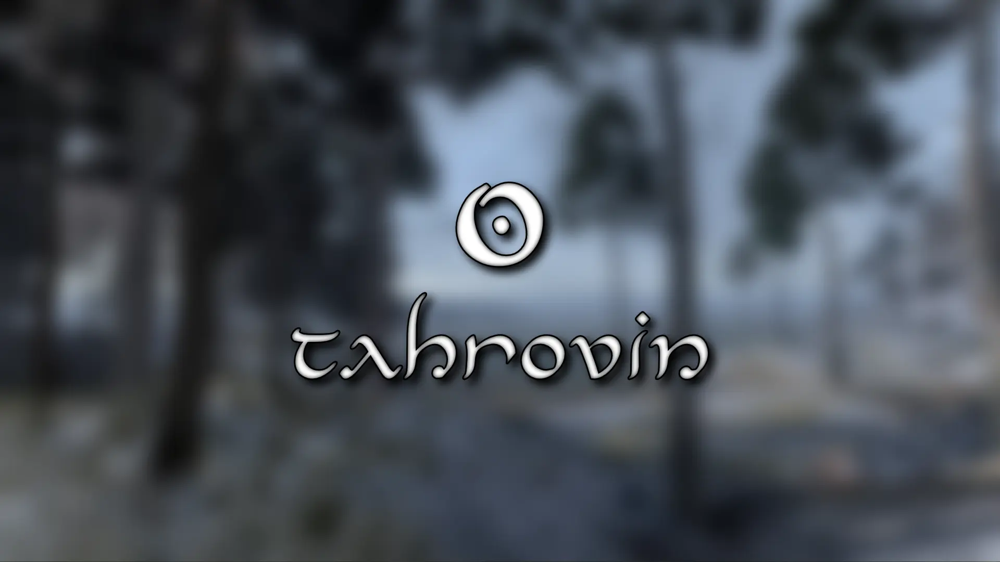
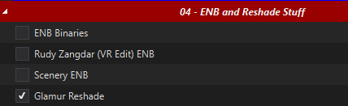
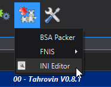

First things first: **this list contains adult content and you must be of legal age in your country. This means 18+ in most countries, 21+ in others. It is up to you to be sure of the age requirement in your country.**

**Support and general talk about Tahrovin resides on the Jolly Co-operators Discord:**

# What is Tahrovin?
Tahrovin is a NSFW Skyrim VR modlist that aims to improve and add upon the Skyrim VR experience. The list features most, if not all, of the fundamental mods needed for any Skyrim VR mod list. The list offers plenty of eye candy paired with everyone's favourite jiggle physics. Yes, this means plenty of skimpy outfits and selectively crafted bodyslides - and no, it's not supposed to be immersive. Don't worry for those who prefer to play as a male character, males have also received attention in this list.

[Here's a link to Load Order Library with a list of the mods included.](https://loadorderlibrary.com/lists/tahrovin-regular-profile)

[Here's the load order for the Degeneracy Edition profile.](https://loadorderlibrary.com/lists/tahrovin-v08-degeneracy-edition)

# Quick Links
- [What is Tahrovin?](#what-is-tahrovin)
- [Quick Links](#quick-links)
- [Before You Start](#before-you-start)
  - [Hardware Requirements](#hardware-requirements)
  - [Accounts](#accounts)
- [Installation](#installation)
  - [Preparation](#preparation)
    - [Install Microsoft Visual C++ Redistributable Packages](#install-microsoft-visual-c-redistributable-packages)
    - [Setup your Page File](#setup-your-page-file)
    - [Setup your Shader Cache](#setup-your-shader-cache)
    - [Configuring Steam](#configuring-steam)
    - [Disable Steam Overlay](#disable-steam-overlay)
    - [Set game language to English](#set-game-language-to-english)
    - [Change Steam's Updating Behavior](#change-steams-updating-behavior)
    - [Clean current Skyrim VR installation](#clean-current-skyrim-vr-installation)
    - [Install Skyrim VR](#install-skyrim-vr)
    - [Start Skyrim VR](#start-skyrim-vr)
  - [Wabbajack](#wabbajack)
  - [Commonly Failing Downloads](#commonly-failing-downloads)
  - [Troubleshooting](#troubleshooting)
- [Post-Installation](#post-installation)
  - [Stock Game](#stock-game)
  - [ENB Selection](#enb-selection)
  - [Creating a desktop shortcut](#creating-a-desktop-shortcut)
  - [INI Configuration](#ini-configuration)
- [Pre-Game Launch](#pre-game-launch)
- [From the Main Menu](#from-the-main-menu)
- [Mod Setup](#mod-setup)
    - [*THIS STEP IS IMPORTANT! IF YOU DO NOT DO THIS STEP, YOUR GAME WILL NOT FUNCTION CORRECTLY!*](#this-step-is-important-if-you-do-not-do-this-step-your-game-will-not-function-correctly)
  - [Mods of Interest](#mods-of-interest)
  - [Controller Bindings](#controller-bindings)
  - [Playing in Seated Mode](#playing-in-seated-mode)
- [FAQ](#faq)
  - [Where's my UI?](#wheres-my-ui)
  - [My companion is stuck on the floor after being "Yamate'd"](#my-companion-is-stuck-on-the-floor-after-being-yamated)
  - [Help I can't see my game!](#help-i-cant-see-my-game)
  - [Is there a way for me to see myself?](#is-there-a-way-for-me-to-see-myself)
- [Updating Tahrovin](#updating-tahrovin)
- [Uninstalling Tahrovin](#uninstalling-tahrovin)
- [Thank You's](#thank-yous)

# Before You Start
Before you dive in, there's a couple things you need to be sure of first:

## Hardware Requirements
I run a relatively powerful PC with the following specs:
  * CPU: Ryzen 7 5800X3D
  * RAM: 32GB DDR4 @ 3600MHz
  * GPU: RTX 3090

I use an Oculus Quest 2 headset with an Oculus link cable for the best potential performance. **If you are using a Quest 2, I have a couple of performance recommendations that you can [find here](Oculus%20Performance%20Tips.md) if you are struggling to get the game to run well.**

Now, I have not built this list to be as graphically intensive as possible but I have taken some liberties in installing higher resolution textures as well as offering a couple of the more demanding ENB presets available. With that in mind, I'd recommend at least the following specs for the best experience:
  * CPU: Intel 7th gen *OR* AMD Ryzen 3000 series 
  * RAM: 16GB of DDR4
  * GPU: GTX 1660 *or the AMD equivalent with at least 6GB of VRAM*

You will need at least `162GB` of disk space on an SSD for the installation. For the downloads, you will need an extra `71GB`- ideally you want *at least* `250GB` for temporary Wabbajack work space. It doesn't have to be an NVMe SSD, but a HDD of any kind will make the list painfully unplayable. 

## Accounts
In terms of accounts you will need:
  * Nexus Premium Account
  * LoversLab Account
  * VectorPlexus Account

Whilst you don't *need* a Nexus premium account to install the modlist, you'll have a considerably better time of it if you do.

# Installation
Please follow all of steps below if it is your first time installing this modlist, if you're updating you can [jump straight there](#updating-tahrovin).

## Preparation

### Install Microsoft Visual C++ Redistributable Packages
This package is a must as it is needed by MO2 - you may already have it if you've used MO2 before. If you do not have it, you want to download the x64 version under "Visual Studio 2015, 2017 and 2019".

[Download Visual C++ Redistributable Package.](https://docs.microsoft.com/en-us/cpp/windows/latest-supported-vc-redist?view=msvc-170)

### Setup your Page File
Skyrim modlists need a large amount of memory purely because of the amount of *stuff* in them - especially modlists on the larger side or with a lot going on, like Tahrovin. For the best experience, you should setup a pagefile of at least **20GB** - yes, even if you have a million GB of RAM. To setup your pagfile;

1. Hold down the *LEFT* Windows key and press **R**
2. Type in `systempropertiesadvanced` in the run box and then press ENTER
3. Under the "Performance" option, click the "Settings..." button
4. Switch to the "Advanced" tab
5. Under "Virtual Memory", click the "Change..." button
6. Uncheck `Automatically manage...` if it's checked
7. Select your *fastest* SSD in the list of drives
8. Check "Custom Size"
9. Set `Initial Size` to 20480
10. Set `Maximum Size` to 20480 also
    1.  *Note: you can set this up to 40000 if you have the space, this will let the pagefile expand to as large as 40GB*
11. Press the "Set" button
12. Press OK
13. Press APPLY and then OK
14. Restart your PC to apply the pagefile setting

### Setup your Shader Cache
Driver defaults from NVidia and AMD for shader cache size is limited to 4GB. Being this small can lead to rare crashes in heavily modified Skyrim installs. Increasing the shader cache size is done via the NVidia Control Panel (I assume the same for AMD users is true also but I don't have AMD hardware to check with). 

*These instructions are NVidia specific as it is the hardware I have.*

1. Open the NVidia Control Panel
2. Head to `Manage 3D Settings`
3. Scroll down in `Global Settings` to find the `Shader Cache Size` option
4. Set the Shader Cache to *at least* 10GB
5. Done

### Configuring Steam
In both global and game settings within Steam and Oculus settings you must ensure the following is set:
  * Supersampling is *OFF*
  * Render Resolution to 100% (1.0 if you're looking at Oculus settings)

### Disable Steam Overlay
The Steam overlay is known to cause issues for both Skyrim VR and regular Skyrim SE/AE, especially when using ENBs. I recommend you turn it off to be sure that it doesn't interfere in any way and you can do so by heading into Steam, right
clicking on Skyrim VR in your game library and clicking **Properties** > **General** > **Deselect "Enable Steam Overlay while in-game"**.

### Set game language to English
Wabbajack and some/most of the modding tools out there only support English language versions of Skyrim. Setting the language to English in Steam will stop issues like Wabbajack file verification failures when installing. As with disabling the overlay, right click on Skyrim VR in your game library and click **Properties** > **Language** > **Select English**.

### Change Steam's Updating Behavior
If for some reason Bethesda decide to release an update for Skyrim VR, everything will probably break. Well, not *everything* but something will definitely break until mods can be updated to suit. To stop this from happening, you need to tell Steam that you only want to update when you tell it to. You can do this by right clicking on Skyrim VR in your game library and clicking **Properties** > **Updates** > **Change Automatic Updates to "Only update this game when I launch it"**. Whilst you're in here, it's also recommended to disable Steam Cloud too.

### Clean current Skyrim VR installation
If you have not yet installed Skyrim VR, you can skip this part.

1. Right click on Skyrim VR in your game library and click **Properties** > **Local Files** > **Browse**. 
2. Uninstall the game via Steam - right click on Skyrim VR in your game library and click **Manage** > **Uninstall**.
3. Check the explorer window for any left over files - if there are any, delete them.
4. Open Windows start menu/search and type in `%LOCALAPPDATA%`.
5. Delete the Skyrim VR folder.
6. Head to `Documents\My Games` and delete the Skyrim VR folder.

### Install Skyrim VR
Once you've done the steps above, you can now set Steam to download Skyrim VR again but ***do not*** install Skyrim VR to a protected folder, such as `Desktop`, `Downloads` or `Program Files` of any kind. It's best to create a new, dedicated folder for it using the Steam Library function somewhere on the root of your drive such as `C:\SteamLibrary`. A lot of people have a dedicated secondary drive for their games, keeping the OS install separate; using this secondary drive will also work.

### Start Skyrim VR
That's right - start the game. You need to let the game do its initial start up jobs such as creating registry entries and generating default config files. Once you've gotten to the main menu you can close the game again.

## Wabbajack
Installing the list is straight forward, Wabbajack will do most of the heavy lifting for you - you only have to tell it where to put stuff. Grab the Tahrovin from the Wabbajack UI, once its downloaded the initial stuff it needs, Wabbajack will have 2 things for you to do - fill in the installation location and the download location. 

Set the installation location to a folder on the root of a drive, something like `C:\Tahrovin`. Do not install it to one of the protected folders as mentioned earlier. The download location will have likely been filled in for you too - ensure it matches the directory you set for the installation location, or if you have multiple Skyrim VR modlists installed, use a common download folder - this will stop you from having to redownload common mods across multiple modlists. 

Before you hit **GO**, a quick tip:

*To get the best performance with Wabbajack, it is recommended that you have the install folder for Wabbajack, the modlist folder and the downloads folder on an SSD; ideally the same SSD.* After the installation is complete, you can move the downloads folder to a storage HDD or other storage medium to save space on your game installation drive. It's not recommended to allow your drive to exceed 90% of its storage space used - Windows Explorer will show a red bar under your drive if you do go over 90% so you need to be sure that you have enough space on your installation drive so that you won't exceed this 90% storage level.

Once you have everything set in Wabbajack, hit **GO** and let it do its thing. It might take a while as there is a fair bit to download and the speed of this will depend on your internet performance as well as your CPU in the later stages for hashing and unpacking the downloads.

## Commonly Failing Downloads
Downloads from file hosts such as Google Drive and Mega can sometimes be a pain and refuse to download automatically via Wabbajack for reasons unknown. Any files that might give you trouble [can be found here for manual download](https://github.com/iAmMe27/Tahrovin/wiki/Commonly-Failing-Downloads).

Download these files and place them *as they are* into the same folder you told Wabbajack to put your downloads in. Let me reiterate just to be sure - **do not unzip the archives!**

## Troubleshooting
If you're having issues with installation, check the [troubleshooting page](Troubleshooting.md). 

# Post-Installation
Almost there but we're not out of the woods yet! After Wabbajack has given you the installation successful screen, you're free to close it. Navigate to the Tahrovin installation folder and run MO2 by double-clicking `ModOrganizer.exe`.

***DO NOT UNDER ANY CIRCUMSTANCES RUN LOOT. The load order is exactly as intended out of the box and you do not need to change it.***

## Stock Game
Tahrovin utilises the stock game feature offered by Wabbajack, meaning that Wabbajack will make a local copy of your Skyrim VR game files during the installation process. This means that your Steam installation of Skyrim VR is completely untouched, even by files that go in the game folder such as ENB files.

## ENB Selection
As mentioned earlier, in both global and game settings within Steam and Oculus settings you must ensure the following is set:
  * Supersampling is *OFF*
  * Render Resolution to 100% (1.0 if you're looking at Oculus settings)

Choosing your ENB is simple and doesn't involve jumping into the game files to manually move stuff about either. In MO2, from the dropdown, select `Essential Files & ENB` and then the run button.

ENB Organizer will then launch. If you see an error message regarding a failure to connect to Nexus Mods for updates, click the OK button.

Click the hamburger menu at the top left of the program and navigate to the Binaries window.

In this screen, toggle the ENB Binaries if you wish to use an ENB Preset. For Oculus headsets, I recommend disabling SteamVR files and the enabling OpenComposite.

*Note: you don't need the ENB binaries for the Glamur Reshade preset*

After toggling both binaries, click the hamburger menu again and navigate to the Presets window.

From this screen, you can choose the ENB of your choice. I'd recommend that you check out the presets pages on Nexus for previews to see which one takes your interest the most. Once you've picked whichever preset you like, click the `SYNC` button.

## Creating a desktop shortcut
Nobody wants to be launching their game via multiple clicks, they want to be able to do it from the desktop! This is simple to do - open MO2, ensure **Tahrovin** is selected in the dropdown and click the "Shortcut" button. From the small dropdown menu, click "Desktop". Of course, you can always run from inside of MO2 by clicking the "Run" button instead.

Done! You should now have a shortcut on your desktop which you can now run the modlist from. Don't run Skyrim VR from within Steam as it won't launch MO2's virtual file system to make a modded game instance.

## INI Configuration
There are a couple of INI tweaks to make to suit your PC and VR headset setup that will make things a little better. From MO2, click the icon that looks like puzzle pieces and then click `INI Editor`. 

In the window that opens, in `skyrimprefs.ini`, set:

- `bUseWandDirectionalMovement`- I recommend setting this to `0` otherwise the movement of your left controller will interfere with the combat as you play. Setting this to `0` will mean you move based on the direction you face your head as opposed to the direction you point your left controller.

- `iHudMenuTextureSize` & `iProjectedMenuTextureSize` - Setting both of these to match the resolution of your HMD will make menus appears much clearer in game. Set this to match the *vertical* resolution of your current HMD settings. For example, with a HMD resolution of 5408 x 2736, you would set these to 2736.

# Pre-Game Launch

**Before launching the game, make sure your VR headset is initialised and both controllers are connected. Launching the game, without both of these conditions met will be a bad time.**

When you first start a new game, you won't find yourself inside of Skyrim anywhere. Instead, you will be inside of the Realm of Lorkhan. This mod replaces the vanilla Skyrim intro, which is known to be extremely buggy, especially in VR. *I'm sure you've seen the vanilla intro already, right?* The Realm of Lorkhan mod is a highly interesting one as it allows you to craft a character that can be allied with factions out of the gate, spawn with all sorts of different equipment and start in many different locations. Have a walk about, see what's around and available to you. Once you teleport at one of the crystals, you'll be dumped into Skyrim in the place you chose. You can return to the realm of Lorkhan at any time by re-using any of these crystals. 

The main quest isn't started in the usual way because the vanilla intro to the game has been replaced. To start the main quest, grab the Dragonstone from Bleak Falls Barrow or talk to Jarl Balgruuf in Whiterun.

# From the Main Menu
Whilst in the main menu, head down into **Settings** and then **VR Performance** - in this menu, ensure that **Dynamic Resolution** is *NOT* enabled. Leaving it on will cause some very serious blurriness in game.

# Mod Setup

### *THIS STEP IS IMPORTANT! IF YOU DO NOT DO THIS STEP, YOUR GAME WILL NOT FUNCTION CORRECTLY!*

When starting a new game, create your character and once done, *DO NOTHING ELSE* and allow the mods to initialise. Once the notifications stop appearing in the top left of your view, you should calibrate VRIK by using the `VRIK Calibration Power` located in your powers menu. Do this while standing on a flat surface in game. Follow the instructions in the VRIK pop-up dialog to ensure you get this right, otherwise you might find yourself towering over everyone else or way too short. Don't worry about making it absolutely perfect, you can recalibrate at any time. After you've calibrated VRIK, head to the Mod Configuration Menu to start the mod setup.

**The MCM setup is automated and will run on its own after you've finished character creation. As mentioned, *DO NOTHING* until the window pops-up telling you to save.**

## Mods of Interest

* **VRIK** - You can tune your calibration settings in here as well as change things such as offsets and arm lengths.
* **PLANCK** - Bringing real interactions into Skyrim VR.
* **Weapon Throw VR** - There are a few presets available to you in here, try them out and see which one you prefer.
* **Spell Wheel VR** - You can change what the spell wheels will show you here as well as the controller binds for showing the spell wheel in the first place.
* **Simply Balanced** - There are a lot of options in this menu to allow you to really tune the balance of the game. You can make it easier to turn yourself into a god, if you like the high-power kind of playthrough or a lot harder to make it a cruel and punishing playthrough. Whilst the options are standard out of the box, I would recommend you reduce the damage of both archery and melee because of the crazy amount of speed you can have compared to regular Skyrim.
* **Strike Obstruction Systems** - You can change the visual effects for timed blocks in here because the default spark effect is buggy and doesn't always show.
* **Conduit** - You can channel your magic through your weapons and when paired with Weapon Throw, it can make for some powerful moves.

## Controller Bindings
[Controller bindings can be found here](ControllerBindings.md)

## Playing in Seated Mode
The modlist features the `Auto Sneak and Jump` mod which relies on your movement in real life to jump and crouch, therefore making it not very useful to you if you prefer to play in seated mode. Unless you'd like to try sneaking everywhere you go, you should be fine to disable this mod from the "Gameplay Mods" section in MO2.

# FAQ

## Where's my UI?
Raise your left wrist to see your health, stamina and magicka bars. Raise your left hand, palm facing upwards, to activate the compass.

## My companion is stuck on the floor after being "Yamate'd"
This is a known issue that is caused by the underlying Havok physics engine. You can usually fix them by hitting them with a heal spell - the fix is to cause an animation change on them.

## Help I can't see my game!
If you have an ENB selected, give it a few seconds as it takes a short period for the game to render as the ENB does its thing.

## Is there a way for me to see myself?
Sure is, raise your right hand above your head and rotate your wrist to turn your character. If you put your right hand down, your character should stay in selfie mode - re-raise your right hand to disable.

# Updating Tahrovin
When an update is released, please always check the [changelog](Changelog.md) first. You may not need to update your modlist but if there is anything that resolves game breaking issues, it'll be noted in the changelog. Backup your saves before you commit to any updates, Wabbajack doesn't usually touch save files, it does has the ability to delete them if it wanted to.

If you have added anything to this modlist at all, Wabbajack will also delete those. You should know how to stop it from doing this if you're going to add stuff to modlists but if you don't, you have to prepend your mod name with `[NoDelete]` - this will make Wabbajack ignore these files. You will need to reinstall these mods and re-sort their load order after an update though, so I hope you kept backup information on where they went in the load order!

All that aside, updates are basically the same as an installation except you have to ensure that you have the "Overwrite" checkbox ticked in Wabbajack.

# Uninstalling Tahrovin
No fancy uninstallation needed, you can just delete the Tahrovin folder and it'll be gone. There'll be no files left inside your Steam installation folder because Tahrovin uses the stock game feature of Wabbajack.

# Thank You's
Massive thank you to the following people:
  * cacophony for making Licentia - Licentia was my first NSFW Skyrim list. It was, and still is, an amazing modlist. Seriously, go play it! Licentia inspired Tahrovin in many ways.
  * Tsukino for making Tsukiro - Tsukiro is also an amazing modlist that deserves your attention. Tsukiro also inspired Tahrovin a lot.
  * The Wabbajack team for making the modern day equivalent of a miracle to make all these modlists possible in the first place.
